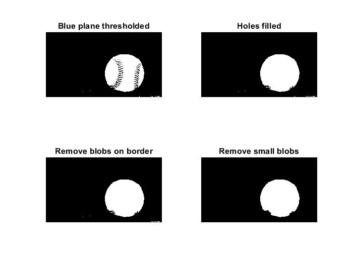

# Object_Diameter
This is a one of the various applications of the image processing i.e measuring the diameter of a given circular object.
### Steps to be followed are:
##### 1.Importing image using *imread* function.

##### 2.Segmentation of Image(Removing Noise)
This is done in further two steps :

1.Color Thresholding

2.Complete segmentation and Cleanup

##### 3.Measuring Object's Diameter both manually and automatically.

##### Output:

